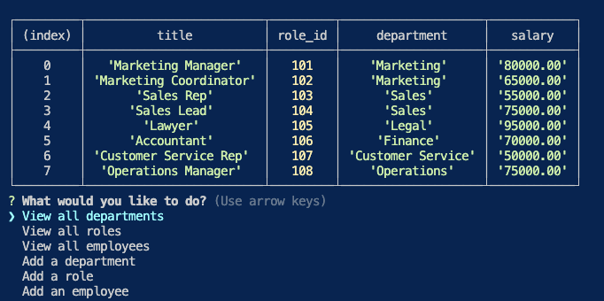

# employeeDatabase

## Description
This application is an employee database. You can view all employees, their position within the company, salary, manager, department, and more. If any edits need to be made, they can be done so within the command line. 

## Criteria:
Must be able to do the following:
  
* View all departments
  * Includes department names and id's

* View all roles 
  * Includes job title, role id, the department that role belongs to, and the salary for that role

* View all employees 
  * employee ids, first names, last names, job titles, departments, salaries, and managers that the employees report to

* Add a department 
* Add a role 
* Add an employee 
* Update an employee role 

## End Product 

<!-- Video of application in progress -->
The following video shows an example of the application being used from the command line:

https://user-images.githubusercontent.com/111533986/221227115-71ceef09-9c6c-45aa-bbc9-c370887e540a.mov

<!-- screenshots -->
Below is a screenshot of the application in use

<!-- link -->
## Deployment
Here is the [link](https://gaughanlnnotesaver.herokuapp.com/) to the Github repository

## Contributing
Lindsey Gaughan (Me!) 

<<<<<<< HEAD

=======

>>>>>>> 8a224afd502d552bb5a00d7267f29ca7612a76bc
